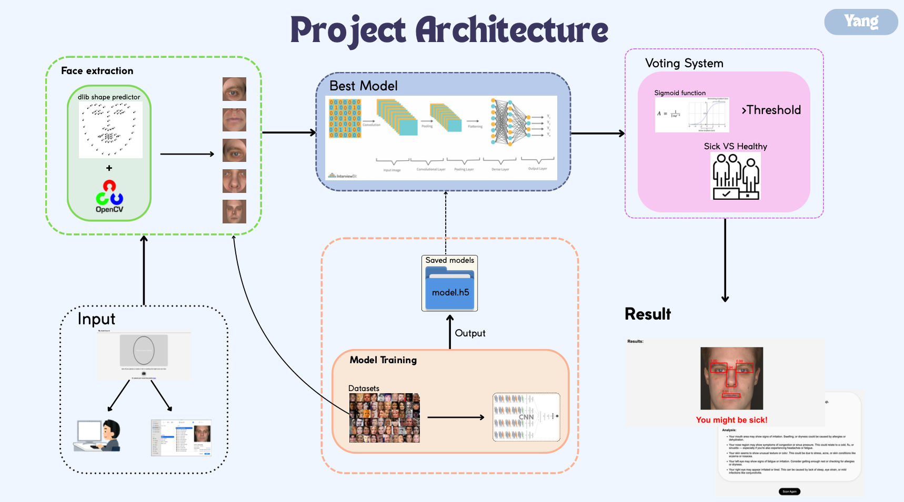
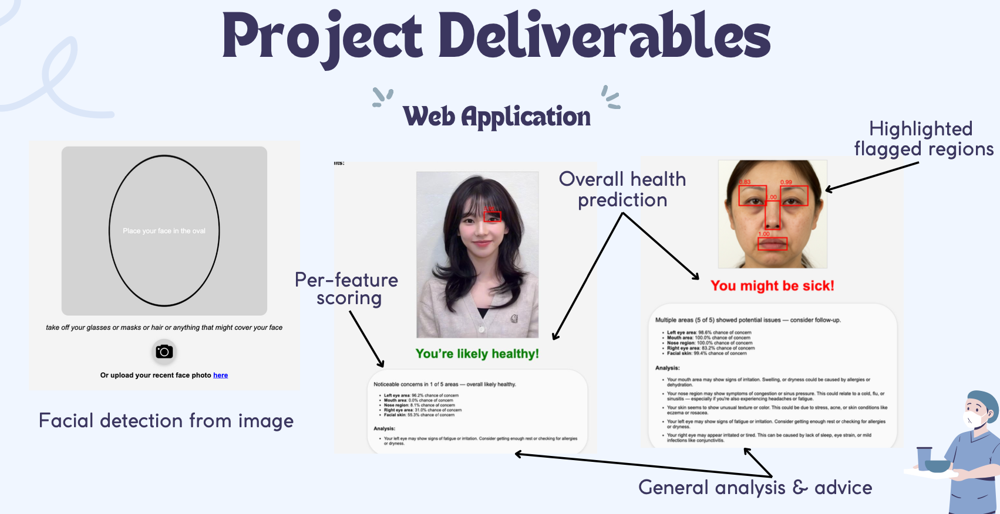

# Health Check With Human Face Scanner

A browser-based health screening web app that classifies facial images as **healthy** or **sick** using an ensemble of region-specific Convolutional Neural Networks (CNNs).

## About
This app analyses five facial regions — left eye, right eye, nose, mouth, and skin — using individually trained CNNs, combining their predictions via majority voting to produce a final classification. Built as a Final Year Project at Monash University, it achieves **97.2% aggregated accuracy** and an average ROC AUC of **0.962** across all subregions.

### Architecture


### Project Deliverables


## Features
- Real-time webcam capture and image file upload
- Per-region confidence scores with visual zone highlights
- Offline-capable and cross-platform (Windows/macOS)

## Tech Stack
Python, TensorFlow, Keras, OpenCV, dlib, Flask, HTML/CSS/JavaScript

---


## How to Run?
1. **Install Dependencies**  
   Ensure you have Python 3.7-3.11 installed. In your terminal, navigate to the project root and run:  
   ```bash
   pip install -r requirements.txt
2. Start the Application
From the project root, launch the Flask app:
    ```bash 
    python app.py
3. Open in Browser
Once the server is running, open your browser and navigate to:
http://127.0.0.1:5000/
or click the link provided in the terminal to access the web app locally.
### Project Structure
* **augment**: folder containing the code of a neural style transfer network
* **categorization**: folder containing a convolutional neural network that categorizes the images
* **categorization/model_saves**: folder containing trained models for the health assessment
* **data/plots**: folder plots of seven training runs conducted 
* **static**: folder containing code handling the web application UI and backend
* **templates**: folder containing all html pages of the web application

### Note
* Data Files:
Place any custom images you wish to test in data/parsed/tmp/ or upload them through the web interface when the app is running.

* Model Files:
Pretrained CNN weights for each facial feature are stored under categorization/model_saves/<feature>/model_<fold>.h5. Do not delete or move these files.

* Temporary Images:
All captured or uploaded images are saved to data/parsed/tmp/ as capture.png (and cropped feature images as capture_<feature>.png).

* Error Handling:
    * If no face is detected, the app will prompt you to try again.
    * Only JPEG/PNG formats are supported; other formats will be rejected with a relevant message.